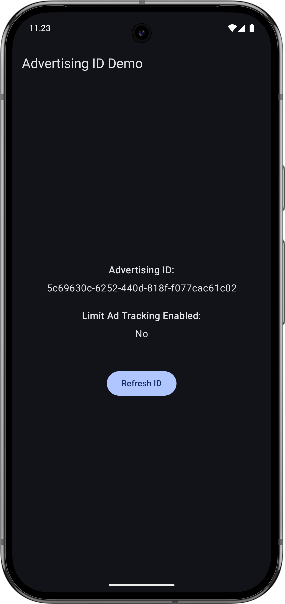

# Ad ID Fetcher Demo

[](https://kotlinlang.org)
[](https://opensource.org/licenses/MIT)

## Overview

This demo application showcases how to robustly retrieve the Android Advertising ID and its "Limit Ad Tracking" status. It utilizes the **Google Play Services Advertising ID API (`com.google.android.gms:play-services-ads-identifier`)**, demonstrating best practices for asynchronous data fetching and graceful error handling when dealing with Google Play Services availability. This ensures reliable data access for advertising and analytics while respecting user privacy settings.

## Screenshots

| ID Retrieved | 
| :----------: |


## Features

  * **Asynchronous Retrieval:** Fetches Advertising ID and status using Kotlin Coroutines on a background thread.
  * **Graceful Error Handling:** Catches specific exceptions related to Google Play Services availability (e.g., `GooglePlayServicesNotAvailableException`, `GooglePlayServicesRepairableException`, `IOException`).
  * **UI State Management:** Displays "Loading...", the retrieved ID/status, or an error message based on the fetch operation's state.
  * **User Control:** Clearly displays the "Limit Ad Tracking" status, indicating the user's preference.
  * **Modern Android Stack:** Built with Jetpack Compose for UI and AndroidX `ViewModel` for state management.

## Getting Started

1.  **Clone the repository:**
    ```bash
    git clone https://github.com/jamie10x/Ad_ID_Demo.git
    ```
2.  Open the project in Android Studio (Jellyfish 2023.3.1 or newer recommended).
3.  Build and run on an Android device or emulator with Google Play Services installed.
    *(Note: For Android 13 (API 33) and above, the `com.google.android.gms.permission.AD_ID` permission is automatically merged into your `AndroidManifest.xml` when you target SDK 33 or higher.)*

## Important Considerations

  * **Google Play Services:** This demo relies on Google Play Services being present and updated on the device.
  * **User Privacy:** Always ensure your app is compliant with Google Play Policies regarding user data and advertising. This includes respecting the "Limit Ad Tracking" flag and obtaining any necessary user consent (e.g., GDPR, CCPA) before using the Advertising ID for personalized advertising or sharing it with third parties.
  * **Stable Libraries:** This project uses stable versions of the Google Play Services Advertising ID API and Jetpack Compose libraries. Always aim to use stable releases in production applications.

## Learn More

For a detailed explanation of this demo, the API usage, and the rationale behind using `com.google.android.gms:play-services-ads-identifier`, check out the accompanying blog post:

[Your App, Their Privacy: Safely Accessing the Advertising ID with Google Play Services](https://jamshidbekboynazarov.medium.com/2fdfbb2dc75b)

## License

This project is licensed under the MIT License. See the [LICENSE](https://opensource.org/licenses/MIT) file for details.

-----
